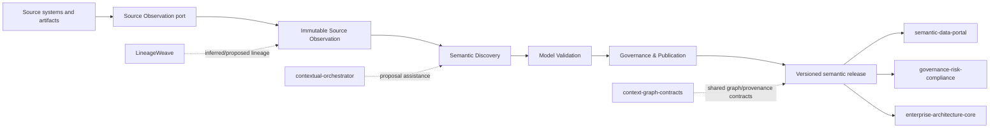

# ConceptWeave Architecture

## Product responsibility

ConceptWeave owns the process that turns observed enterprise evidence into governed semantic-model releases. It does not own source-system truth or downstream catalog/query experiences.



## DDD context map

| Context | Type | Owns | Does not own |
| --- | --- | --- | --- |
| Source Observation | Supporting | bounded source-access port policy, immutable observations, parser/extractor receipts, evidence locations | credentials, source-system business truth, semantic inference |
| Semantic Discovery | Core | candidate generation and evidence binding | publication authority |
| Model Validation | Supporting | deterministic validation reports | human review decisions |
| Governance & Publication | Core | proposal lifecycle, review receipts, releases, supersession | catalog/search runtime |
| Interoperability | Supporting | versioned import/export and ACL adapters | foreign product internals |

## Aggregate and value-object boundaries

### ObservationRequest / ObservationLimits

Provider-independent Source Observation port value objects. A request contains only a bounded opaque source registry key (at most 128 bytes, lowercase multiword `snake_case`) that is resolved behind the adapter credential boundary, an explicit non-empty exact-schema allowlist, and positive statement-timeout/row/byte/concurrency budgets. Raw DSNs, URLs, shell-style connection parameters, one-word/generic keys, and malformed registry identifiers fail closed before adapter access. Blank or duplicate schema identifiers also fail closed. Caller cancellation and source-disappearance/resource-limit outcomes are part of the typed port seam. Concrete PostgreSQL drivers, credentials, catalog SQL, and scheduling remain adapter responsibilities outside the domain and observation-fact crates. ADR 0004 remains Proposed until a concrete adapter and conformance evidence are integrated.

### PostgresSchemaSnapshot

Immutable Source Observation aggregate for one bounded relational metadata capture. It owns source-connection reference, snapshot digest identity, extractor revision, observation time, and exact qualified table observations. Qualified identifiers are preserved rather than normalized; duplicate table coordinates fail closed. A concrete adapter may construct this aggregate only after a complete bounded capture; cancellation, source disappearance, or resource exhaustion must not produce a partial snapshot.

### TableObservation / ColumnObservation

Immutable Source Observation value objects. Table observations keep exact schema/table identity. Column observations keep exact source name, one-based ordinal, source type, nullability, and optional source comment. Duplicate names or ordinals within a table fail closed, and read APIs return deterministic source order.

### PrimaryKeyObservation / UniqueConstraintObservation / ForeignKeyObservation / CheckConstraintObservation

Immutable Source Observation value objects for deterministic constraint evidence. Composite key order is preserved exactly. Foreign keys retain ordered local and referenced coordinates, including cross-schema targets. When the source adapter observes foreign-key reference behavior, `ForeignKeyReferenceBehavior` preserves exact `ON UPDATE` and `ON DELETE` actions, match type, and deferrability/initial timing; when it observes PostgreSQL 18 constraint state, `ForeignKeyObservation` also preserves exact `convalidated` and `conenforced` booleans. Either metadata family remains explicitly absent when not observed rather than deriving PostgreSQL defaults.

`CheckConstraintObservation` retains the reconstructed PostgreSQL definition together with validation, enforcement, and `NO INHERIT` status. PostgreSQL stores a CHECK expression internally and recommends `pg_get_constraintdef()` for reconstruction, so ConceptWeave preserves that adapter-supplied definition as source evidence rather than parsing it into guessed ordered column coordinates. Constraint names remain unique within a table observation, while explicit PK/unique/FK coordinate lists must bind to observed local columns. These contracts preserve source metadata only and do not infer join semantics, CHECK dependencies, or business meaning.

### SemanticCandidate

Smallest consistency boundary for a single proposed semantic artifact and its evidence-bound publication state. It cannot jump directly from Draft to Published.

### SemanticModelRelease (planned)

Immutable publication aggregate containing approved candidate identities, release version, artifact digests, validation receipts, reviewer receipts, and supersession metadata. It will reference candidates rather than copy foreign source records.

## Truth model

- `observed`: exact source fact;
- `inferred`: derived candidate;
- `proposed`: submitted for governance;
- `authoritative`: explicitly reviewed and published;
- `superseded`: formerly authoritative and replaced;
- `rejected`: explicitly rejected.

Truth status and publication workflow are distinct. A source observation can be authoritative in its source domain without making an inferred semantic interpretation authoritative.

## Integration boundaries

- `contextual-orchestrator`: LLM/model routing only.
- `LineageWeave`: inferred/proposed lineage evidence only.
- `semantic-data-portal`: published semantic artifact consumer/governance/catalog plane; it is not ConceptWeave's internal database.
- `context-graph-contracts`: shared cross-product identifiers, truth/provenance/event contracts where adopted.
- Keyverse: future identity/tenant authentication boundary.

No direct cross-service application-table SQL is permitted. A PostgreSQL Source Observation adapter may access only explicitly authorized read-only metadata through the port contract and must not become a hidden foreign-product repository.

## Current directory structure

```text
crates/
  conceptweave-domain/       # Core candidate/evidence lifecycle contract
  conceptweave-observation/  # Provider-independent immutable source-observation facts
  conceptweave-source-port/  # Provider-independent source-access budgets/cancellation/failure seam
contracts/                   # Versioned public schemas
docs/
  adr/                       # Binding/proposed architecture decisions
  doctoring/                 # Standards/research evidence
scripts/                     # Deterministic repository-quality helpers
.github/workflows/           # CI evidence
```

Concrete adapters and application services are added only when their bounded responsibility exists; generic `utils`, `helpers`, or `services` dumping grounds are prohibited.
