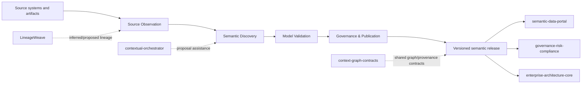

# ConceptWeave Architecture

## Product responsibility

ConceptWeave owns the process that turns observed enterprise evidence into governed semantic-model releases. It does not own source-system truth or downstream catalog/query experiences.



## DDD context map

| Context | Type | Owns | Does not own |
| --- | --- | --- | --- |
| Source Observation | Supporting | immutable observations, parser/extractor receipts, evidence locations | source-system business truth, semantic inference |
| Semantic Discovery | Core | candidate generation and evidence binding | publication authority |
| Model Validation | Supporting | deterministic validation reports | human review decisions |
| Governance & Publication | Core | proposal lifecycle, review receipts, releases, supersession | catalog/search runtime |
| Interoperability | Supporting | versioned import/export and ACL adapters | foreign product internals |

## Aggregate and value-object boundaries

### PostgresSchemaSnapshot

Immutable Source Observation aggregate for one bounded relational metadata capture. It owns source-connection reference, snapshot digest identity, extractor revision, observation time, and exact qualified table observations. Qualified identifiers are preserved rather than normalized; duplicate table coordinates fail closed.

### TableObservation / ColumnObservation

Immutable Source Observation value objects. Table observations keep exact schema/table identity. Column observations keep exact source name, one-based ordinal, source type, nullability, and optional source comment. Duplicate names or ordinals within a table fail closed, and read APIs return deterministic source order.

### PrimaryKeyObservation / UniqueConstraintObservation / ForeignKeyObservation

Immutable Source Observation value objects for deterministic key and relationship evidence. Composite key order is preserved exactly. Foreign keys retain ordered local and referenced coordinates, including cross-schema targets. Constraint names must be unique within a table observation; empty or duplicate coordinate lists fail closed; every local constraint column must exist in the same observed table. These contracts preserve source metadata only and do not infer join semantics or business meaning.

### SemanticCandidate

Smallest consistency boundary for a single proposed semantic artifact and its evidence-bound publication state. It cannot jump directly from Draft to Published.

### SemanticModelRelease (planned)

Immutable publication aggregate containing approved candidate identities, release version, artifact digests, validation receipts, reviewer receipts, and supersession metadata. It will reference candidates rather than copy foreign source records.

## Truth model

- `observed`: exact source fact;
- `inferred`: derived candidate;
- `proposed`: submitted for governance;
- `authoritative`: explicitly reviewed and published;
- `superseded`: formerly authoritative and replaced;
- `rejected`: explicitly rejected.

Truth status and publication workflow are distinct. A source observation can be authoritative in its source domain without making an inferred semantic interpretation authoritative.

## Integration boundaries

- `contextual-orchestrator`: LLM/model routing only.
- `LineageWeave`: inferred/proposed lineage evidence only.
- `semantic-data-portal`: published semantic artifact consumer/governance/catalog plane; it is not ConceptWeave's internal database.
- `context-graph-contracts`: shared cross-product identifiers, truth/provenance/event contracts where adopted.
- Keyverse: future identity/tenant authentication boundary.

No direct cross-service application-table SQL is permitted.

## Current directory structure

```text
crates/
  conceptweave-domain/       # Core candidate/evidence lifecycle contract
  conceptweave-observation/  # Provider-independent immutable source-observation contract
contracts/                   # Versioned public schemas
docs/
  adr/                       # Binding architecture decisions
  doctoring/                 # Standards/research evidence
scripts/                     # Deterministic repository-quality helpers
.github/workflows/           # CI evidence
```

Adapters and application services are added only when their bounded responsibility exists; generic `utils`, `helpers`, or `services` dumping grounds are prohibited.
