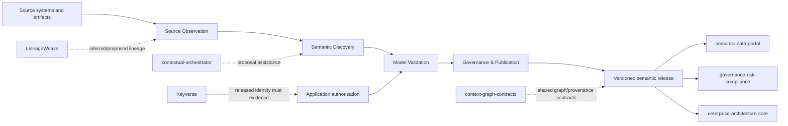

# ConceptWeave Architecture

## Product responsibility

ConceptWeave owns the process that turns observed enterprise evidence into governed semantic-model releases. It does not own source-system truth or downstream catalog/query experiences.



## DDD context map

| Context | Type | Owns | Does not own |
| --- | --- | --- | --- |
| Source Observation | Supporting | immutable observations, parser receipts, evidence locations | source-system business truth |
| Semantic Discovery | Core | candidate generation and evidence binding | publication authority |
| Model Validation | Supporting | deterministic validation reports | human review decisions |
| Governance & Publication | Core | proposal lifecycle, review receipts, releases, supersession | catalog/search runtime |
| Interoperability | Supporting | versioned import/export and ACL adapters | foreign product internals |

## Aggregate boundaries

### SemanticCandidate

Smallest consistency boundary for a single proposed semantic artifact and its evidence-bound publication state. It cannot jump directly from Draft to Published.

### SemanticModelRelease (planned)

Immutable publication aggregate containing approved candidate identities, release version, artifact digests, validation receipts, reviewer receipts, and supersession metadata. It will reference candidates rather than copy foreign source records.

## Truth model

- `observed`: exact source fact;
- `inferred`: derived candidate;
- `proposed`: submitted for governance;
- `authoritative`: explicitly reviewed and published;
- `superseded`: formerly authoritative and replaced;
- `rejected`: explicitly rejected.

Truth status and publication workflow are distinct. A source observation can be authoritative in its source domain without making an inferred semantic interpretation authoritative.

## Integration boundaries

- `contextual-orchestrator`: LLM/model routing only.
- `LineageWeave`: inferred/proposed lineage evidence only.
- `semantic-data-portal`: published semantic artifact consumer/governance/catalog plane; it is not ConceptWeave's internal database.
- `context-graph-contracts`: shared cross-product identifiers, truth/provenance/event contracts where adopted.
- Keyverse: identity/credential/authentication trust owner. ConceptWeave consumes only an immutable released trust contract and retains authorization of ConceptWeave proposal/base resources.

No direct cross-service application-table SQL is permitted. No mutable sibling source, provider-specific authentication code, or caller-minted `authenticated` flag may substitute for a released owner contract.

## Foundation directory structure

```text
crates/
  conceptweave-domain/       # Core domain contract only
contracts/                   # Versioned public schemas
docs/
  adr/                       # Binding architecture decisions
  doctoring/                 # Standards/research evidence
scripts/                     # Deterministic repository-quality helpers
.github/workflows/           # CI evidence
```

Adapters and application services are added only when their bounded responsibility exists; generic `utils`, `helpers`, or `services` dumping grounds are prohibited. `conceptweave-domain` remains provider/network/database free.

## Procedural knowledge profile — Proposed

The existing discovery/validation/publication contexts also own procedure concepts,
advisory relations, evidence alignment and reviewed model revisions. Noema consumes
a released projection for online advice and retains execution/cancellation authority.
CO supplies model calls; CGC owns shared interchange; SDP catalogs releases; EAC owns
the architecture/adoption map. Product factual and policy authority do not move.

The current #44 Draft source now contains private Rust seams for bounded raw-byte/
UTF-8/strict-JSON admission, canonical Draft 2020-12 mapping, semantic/topology
validation, and revision-envelope/base/candidate-scope comparison. This is source-shaped
implementation, not a protected or released service boundary. The separately supplied
revision expectation is not authentication evidence.

The next application boundary waits for an immutable released Keyverse trust contract,
then applies ConceptWeave-owned proposal/base authorization before constructing the
private revision expectation. Native Rust 1.98 and hosted Product acceptance must also
be re-established on one unchanged post-prerequisite head before any seam is widened.
Released artifact authenticity/ACL/capability, independent evaluation, stewardship,
immutable publication, CGC projection and Noema activation remain later gates.

See [ADR-PG-20260910](docs/adr/pg_20260910_procedural_model_engineering.md) for the
context/aggregate map, current source implementation, trust split and acceptance gates.
