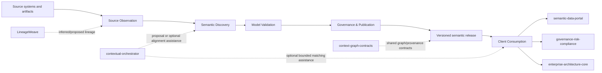

# ConceptWeave Architecture

## Product responsibility

ConceptWeave owns the process that turns observed enterprise evidence into governed semantic-model releases and the stable client contract used to inspect those releases. It does not own source-system truth, consuming-product authorization, physical query execution, or downstream catalog/search experiences.



## DDD context map

| Context | Type | Owns | Does not own |
| --- | --- | --- | --- |
| Source Observation | Supporting | immutable observations, parser receipts, evidence locations | source-system business truth |
| Semantic Discovery | Core | candidate generation and evidence binding | publication authority |
| Model Validation | Supporting | deterministic validation reports | human review decisions |
| Governance & Publication | Core | proposal lifecycle, review receipts, releases, supersession authority | catalog/search runtime |
| Client Consumption | Supporting | release admission, compatibility, exact byte verification, diff/resolution, explicit immutable supersession validation, future match/query-plan contracts | generator internals, consumer authorization, publication authority, physical query execution |
| Interoperability | Supporting | versioned import/export and ACL adapters | foreign product internals |

The generation-to-client dependency crosses only versioned public release contracts. Client code may reuse public domain value types, but it must not import generator-private adapters, prompts, persistence tables, Source Observation internals, or orchestration state.

## Aggregate and value-object boundaries

### SemanticCandidate

Smallest consistency boundary for a single proposed semantic artifact and its evidence-bound publication state. It cannot jump directly from Draft to Published.

### SemanticModelRelease

Planned Governance & Publication aggregate for immutable publication. The current Client slice defines only the consumer-visible release contract: stable release identity, contract and ontology versions, truth/publication state, declared artifact digest identity, provenance references, and stable concept identifiers. Release construction is not publication authority.

### ReleaseDigest

Client value object for a declared canonical `sha256:<64 lowercase hex>` digest identity. It validates digest syntax only. Exact detached artifact bytes must be hashed and compared before integrity is claimed.

### SemanticReleaseReference

Client value object that binds a stable semantic-release id to its exact artifact digest. It is an immutable coordinate for published release identity and avoids treating a mutable name or version number alone as sufficient supersession evidence.

### ReleaseSupersession

Client-visible immutable declaration naming an exact predecessor reference, exact successor reference, and nonblank rationale. It rejects self-supersession. Client validation requires both releases to pass normal Published + Authoritative compatibility admission and both id+digest references to match exactly. The declaration does not mutate either release and never infers replacement from version ordering, timestamps, diff size, or semantic similarity. Governance & Publication remains the authority that creates the eventual publication/supersession receipt; the Client only validates the consumer-visible contract.

### SemanticReleaseClient

A stateless domain service in Client Consumption. Its compatibility policy has one explicit current contract version and an explicit set of supported legacy versions; it never infers compatibility from semantic-version ordering. Unknown versions fail closed. Current and supported-legacy releases pass the same `Published` plus `Authoritative` gate before resolution, diff, artifact verification, or supersession validation. It performs no network, LLM, database, tenant-authorization, publication-decision, or physical-query work.

## Truth model

- `observed`: exact source fact;
- `inferred`: derived candidate;
- `proposed`: submitted for governance;
- `authoritative`: explicitly reviewed and published;
- `superseded`: formerly authoritative and replaced through explicit release evidence;
- `rejected`: explicitly rejected.

Truth status and publication workflow are distinct. A source observation can be authoritative in its source domain without making an inferred semantic interpretation authoritative. Client admission fails closed rather than coercing these states. Supersession preserves the immutable prior release rather than overwriting it.

## Integration boundaries

- `contextual-orchestrator`: all production LLM/model routing; optional future matching/explanation is still proposal evidence.
- `LineageWeave`: inferred/proposed lineage evidence only.
- `semantic-data-portal`: published semantic artifact consumer/governance/catalog plane; it is not ConceptWeave's internal database.
- `context-graph-contracts`: shared cross-product identifiers, truth/provenance/event contracts where adopted.
- Keyverse: future identity/tenant authentication boundary.
- Consuming products: retain tenant/purpose authorization, business-domain truth, and physical data/query execution behind their own ACLs.

No direct cross-service application-table SQL is permitted.

## Current directory structure

```text
crates/
  conceptweave-domain/       # Core candidate/evidence lifecycle contracts
  conceptweave-client/       # Offline release admission, compatibility, integrity and supersession validation
contracts/                   # Versioned public JSON Schemas and fixtures
docs/
  adr/                       # Proposed/accepted architecture decisions
  doctoring/                 # Standards/research evidence
scripts/                     # Deterministic repository-quality helpers
.github/workflows/           # CI evidence
```

Adapters and application services are added only when their bounded responsibility exists; generic `utils`, `helpers`, or `services` dumping grounds are prohibited.

ADR 0004 remains Proposed while PR #5 is Draft and current-head checks/governance are incomplete; implementation on an unintegrated head is not sufficient to mark the architecture decision Accepted.
