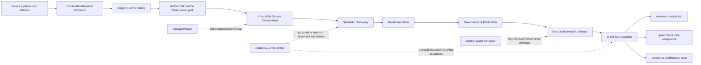

# ConceptWeave Architecture

## Product responsibility

ConceptWeave owns the process that turns observed enterprise evidence into governed semantic-model releases and the stable client contract used to inspect those releases. It does not own source-system truth, consuming-product authorization, physical query execution, or downstream catalog/search experiences.



## DDD context map

| Context | Type | Owns | Does not own |
| --- | --- | --- | --- |
| Source Observation | Supporting | bounded request admission, registry authorization capability binding, source-access port policy, immutable observations, parser/extractor receipts, evidence locations | credentials, source-system business truth, semantic inference |
| Semantic Discovery | Core | candidate generation and evidence binding | publication authority |
| Model Validation | Supporting | deterministic validation reports | human review decisions |
| Governance & Publication | Core | proposal lifecycle, review receipts, releases, supersession authority | catalog/search runtime |
| Client Consumption | Supporting | release admission, compatibility, exact byte verification, diff/resolution, explicit immutable supersession validation, future match/query-plan contracts | generator internals, consumer authorization, publication authority, physical query execution |
| Interoperability | Supporting | versioned import/export and ACL adapters | foreign product internals |

The generation-to-client dependency crosses only versioned public release contracts. Client code may reuse public domain value types, but it must not import generator-private adapters, prompts, persistence tables, Source Observation internals, or orchestration state.

## Aggregate and value-object boundaries

### ObservationRequest / ObservationRequestBudget / ObservationLimits / AuthorizedObservationRequest

Provider-independent Source Observation port value objects. A raw request contains only a bounded opaque source registry key (at most 128 bytes, lowercase multiword `snake_case`), an explicit non-empty exact-schema allowlist, a caller-selected positive authorization-metadata budget (maximum schema count plus total retained UTF-8 schema bytes), and positive operation/statement-timeout, row, byte, and concurrency execution budgets. Request count/byte admission is enforced before registry or database access and deliberately does not reuse PostgreSQL's build-time identifier-length default as a security constant.

A well-formed key is not authority. `ObservationRequest::authorize` resolves the exact key through the caller's `SourceConnectionRegistry` and produces `AuthorizedObservationRequest`, which privately binds the validated request to the opaque `ResolvedSourceConnection`. `SourceObservationPort::observe` accepts only this authorized envelope. Unknown registry entries therefore fail before adapter execution, and raw DSNs, URLs, shell-style connection parameters, one-word/generic keys, malformed registry identifiers, over-budget allowlists, blank schema names, exact duplicates and raw credentials do not cross the canonical execution seam. The concrete adapter maps the authorized opaque capability to credentials only inside its ACL.

Exact schema identifiers retain source spelling. Caller cancellation and source-disappearance/resource-limit outcomes are part of the typed port seam. Request admission and registry authorization remain deterministic pre-adapter steps; live adapter execution is awaitable and returns a `Send` future without making an async runtime part of the port contract. The end-to-end operation budget still covers authorization, connection and catalog work, so runtime integration must account for pre-adapter authorization elapsed time rather than restarting the deadline at `observe`. Concrete PostgreSQL drivers, credentials, catalog SQL and scheduling remain adapter responsibilities outside the domain and observation-fact crates. ADR 0004 remains Proposed until a concrete adapter and conformance evidence prove these invariants.

### PostgresSchemaSnapshot

Immutable Source Observation aggregate for one bounded relational metadata capture. It owns source-connection reference, snapshot digest identity, extractor revision, observation time, and exact qualified table observations. Qualified identifiers are preserved rather than normalized; duplicate table coordinates fail closed. A concrete adapter may construct this aggregate only after a complete bounded capture; cancellation, source disappearance, or resource exhaustion must not produce a partial snapshot.

### TableObservation / ColumnObservation

Immutable Source Observation value objects. Table observations keep exact schema/table identity. Column observations keep exact source name, one-based ordinal, source type, nullability, and optional source comment. Duplicate names or ordinals within a table fail closed, and read APIs return deterministic source order.

### PrimaryKeyObservation / UniqueConstraintObservation / ForeignKeyObservation / CheckConstraintObservation

Immutable Source Observation value objects for deterministic constraint evidence. Composite key order is preserved exactly. Foreign keys retain ordered local and referenced coordinates, including cross-schema targets. When the source adapter observes foreign-key reference behavior, `ForeignKeyReferenceBehavior` preserves exact `ON UPDATE` and `ON DELETE` actions, any PostgreSQL column subset targeted by `ON DELETE SET NULL` or `SET DEFAULT`, match type, and deferrability/initial timing; when it observes PostgreSQL 18 constraint state, `ForeignKeyObservation` also preserves exact `convalidated` and `conenforced` booleans. Either metadata family remains explicitly absent when not observed rather than deriving PostgreSQL defaults.

`CheckConstraintObservation` retains the reconstructed PostgreSQL definition together with validation, enforcement, and `NO INHERIT` status. PostgreSQL stores a CHECK expression internally and recommends `pg_get_constraintdef()` for reconstruction, so ConceptWeave preserves that adapter-supplied definition as source evidence rather than parsing it into guessed ordered column coordinates. Constraint names remain unique within a table observation, while explicit PK/unique/FK coordinate lists must bind to observed local columns. These contracts preserve source metadata only and do not infer join semantics, CHECK dependencies, or business meaning.

### SemanticCandidate

Smallest consistency boundary for a single proposed semantic artifact and its evidence-bound publication state. It cannot jump directly from Draft to Published.

### SemanticModelRelease

Planned Governance & Publication aggregate for immutable publication. The current Client slice defines only the consumer-visible release contract: stable release identity, contract and ontology versions, truth/publication state, declared artifact digest identity, provenance references, and stable concept identifiers. Release construction is not publication authority.

### ReleaseDigest

Client value object for a declared canonical `sha256:<64 lowercase hex>` digest identity. It validates digest syntax only. Exact detached artifact bytes must be hashed and compared before integrity is claimed.

### SemanticReleaseReference

Client value object that binds a stable semantic-release id to its exact artifact digest. It is an immutable coordinate for published release identity and avoids treating a mutable name or version number alone as sufficient supersession evidence.

### ReleaseSupersession

Client-visible immutable declaration naming an exact predecessor reference, exact successor reference, and nonblank rationale. It rejects self-supersession. Client validation requires both releases to pass normal Published + Authoritative compatibility admission and both id+digest references to match exactly. The declaration does not mutate either release and never infers replacement from version ordering, timestamps, diff size, or semantic similarity. Governance & Publication remains the authority that creates the eventual publication/supersession receipt; the Client only validates the consumer-visible contract.

### SemanticReleaseClient

A stateless domain service in Client Consumption. Its compatibility policy has one explicit current contract version and an explicit set of supported legacy versions; it never infers compatibility from semantic-version ordering. Unknown versions fail closed. Current and supported-legacy releases pass the same `Published` plus `Authoritative` gate before resolution, diff, artifact verification, or supersession validation. It performs no network, LLM, database, tenant-authorization, publication-decision, or physical-query work.

## Truth model

- `observed`: exact source fact;
- `inferred`: derived candidate;
- `proposed`: submitted for governance;
- `authoritative`: explicitly reviewed and published;
- `superseded`: formerly authoritative and replaced through explicit release evidence;
- `rejected`: explicitly rejected.

Truth status and publication workflow are distinct. A source observation can be authoritative in its source domain without making an inferred semantic interpretation authoritative. Client admission fails closed rather than coercing these states. Supersession preserves the immutable prior release rather than overwriting it.

## Integration boundaries

- `contextual-orchestrator`: all production LLM/model routing; optional future matching/explanation is still proposal evidence.
- `LineageWeave`: inferred/proposed lineage evidence only.
- `semantic-data-portal`: published semantic artifact consumer/governance/catalog plane; it is not ConceptWeave's internal database.
- `context-graph-contracts`: shared cross-product identifiers, truth/provenance/event contracts where adopted.
- Keyverse: future identity/tenant authentication boundary.
- Consuming products: retain tenant/purpose authorization, business-domain truth, and physical data/query execution behind their own ACLs.

No direct cross-service application-table SQL is permitted. A PostgreSQL Source Observation adapter may access only explicitly authorized read-only metadata through the port contract and must not become a hidden foreign-product repository.

## Current directory structure

```text
crates/
  conceptweave-domain/       # Core candidate/evidence lifecycle contracts
  conceptweave-client/       # Offline release admission, compatibility, integrity and supersession validation
  conceptweave-observation/  # Provider-independent immutable source-observation facts
  conceptweave-source-port/  # Request admission, registry authorization and source-access execution seam
contracts/                   # Versioned public JSON Schemas and fixtures
docs/
  adr/                       # Proposed/accepted architecture decisions
  doctoring/                 # Standards/research evidence
scripts/                     # Deterministic repository-quality helpers
.github/workflows/           # CI evidence
```

Adapters and application services are added only when their bounded responsibility exists; generic `utils`, `helpers`, or `services` dumping grounds are prohibited.

ADR 0005 remains Proposed while PR #5 is Draft and current-head checks/governance are incomplete; implementation on an unintegrated head is not sufficient to mark the architecture decision Accepted.