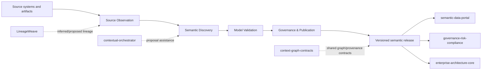

# ConceptWeave Architecture

## Product responsibility

ConceptWeave owns the process that turns observed enterprise evidence into governed semantic-model releases. It does not own source-system truth or downstream catalog/query experiences.



## DDD context map

Research Intake's Zotero adapter retains optional full-text observations in a separate private artifact bound to the original metadata report. It remains inside ConceptWeave: acquisition is supporting evidence work, not a publication authority or another research system of record. Provider version counters remain opaque at this Anti-Corruption Layer; downstream classification and review must explicitly adopt new content under fresh evidence bindings. See [ADR 0006](docs/adr/0006-zotero-research-intake.md).

Its Full-Text Review View reuses capture verification and canonical pending selection to make exact text inspectable without changing earlier proposals. This bounded read projection is not an aggregate or a decision-application API; the metadata-only approval chain does not acquire full-text provenance from it.

The separate Full-Text Review Worksheet starts blank and retains one capture identity through atomic completed-view application, finalization and whole-envelope governance verification. Every boundary rechecks the capture against the complete report. It reuses existing review cores rather than introducing another service or source of semantic truth. The CLI only initializes this work; the remaining operations are library APIs. Verified review still does not admit Zotero writes, whose exact change set requires independent authorization.

| Context | Type | Owns | Does not own |
| --- | --- | --- | --- |
| Source Observation | Supporting | immutable observations, parser receipts, evidence locations | source-system business truth |
| Semantic Discovery | Core | candidate generation and evidence binding | publication authority |
| Model Validation | Supporting | deterministic validation reports | human review decisions |
| Governance & Publication | Core | proposal lifecycle, review receipts, releases, supersession | catalog/search runtime |
| Interoperability | Supporting | versioned import/export and ACL adapters | foreign product internals |

## Aggregate boundaries

### SemanticCandidate

Smallest consistency boundary for a single proposed semantic artifact and its evidence-bound publication state. It cannot jump directly from Draft to Published.

### SemanticModelRelease (planned)

Immutable publication aggregate containing approved candidate identities, release version, artifact digests, validation receipts, reviewer receipts, and supersession metadata. It will reference candidates rather than copy foreign source records.

## Truth model

- `observed`: exact source fact;
- `inferred`: derived candidate;
- `proposed`: submitted for governance;
- `authoritative`: explicitly reviewed and published;
- `superseded`: formerly authoritative and replaced;
- `rejected`: explicitly rejected.

Truth status and publication workflow are distinct. A source observation can be authoritative in its source domain without making an inferred semantic interpretation authoritative.

## Integration boundaries

- `contextual-orchestrator`: LLM/model routing only.
- `LineageWeave`: inferred/proposed lineage evidence only.
- `semantic-data-portal`: published semantic artifact consumer/governance/catalog plane; it is not ConceptWeave's internal database.
- `context-graph-contracts`: shared cross-product identifiers, truth/provenance/event contracts where adopted.
- Keyverse: future identity/tenant authentication boundary.

No direct cross-service application-table SQL is permitted.

## Foundation directory structure

```text
crates/
  conceptweave-domain/       # Core domain contract only
contracts/                   # Versioned public schemas
docs/
  adr/                       # Binding architecture decisions
  doctoring/                 # Standards/research evidence
scripts/                     # Deterministic repository-quality helpers
.github/workflows/           # CI evidence
```

Adapters and application services are added only when their bounded responsibility exists; generic `utils`, `helpers`, or `services` dumping grounds are prohibited.
