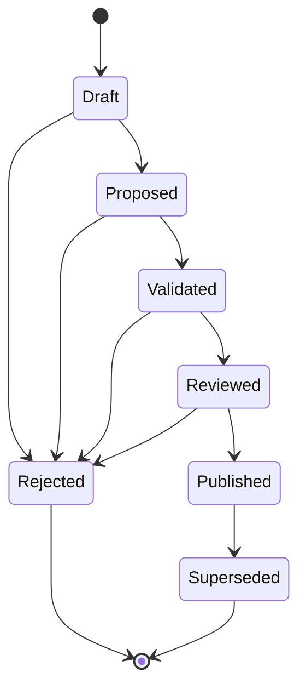
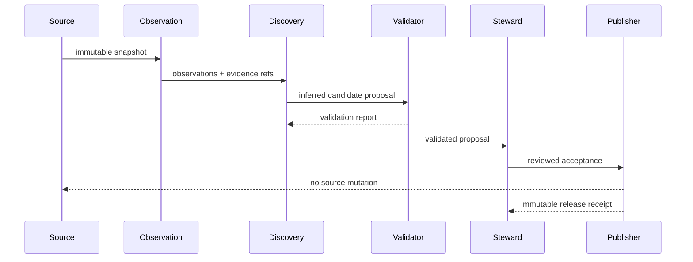

# UML and lifecycle views

## Candidate state machine



## Foundation sequence



## Research intake sequence

```mermaid
sequenceDiagram
    participant Zotero as Zotero Local API
    participant Intake as Research intake
    participant Report as Local proposal report
    participant Steward

    loop bounded pages
        Intake->>Zotero: read items at one library version
        Zotero-->>Intake: items + observed library version
        Intake->>Intake: validate page consistency and every item revision; fail entire read on mismatch
    end
    Intake->>Intake: classify or abstain; link children; find duplicate candidates
    Intake->>Intake: retain excluded metadata; traverse parent links from bibliographic roots
    Intake->>Report: write proposals, complete inventory and unresolved source keys
    Note over Report,Steward: Pending sources prevent a whole-library completion claim; inventory is not approval
    Report->>Steward: review dispositions and merge candidates
    Steward->>Intake: reviewed labels and independently issued receipt
    Intake->>Intake: validate complete partitions and recompute pending ancestry
    Intake->>Intake: verify v2 proposal and retained-source binding
    Note over Intake,Steward: Only locally valid reports reach independent governance verification
    Intake-->>Zotero: no mutation
```
