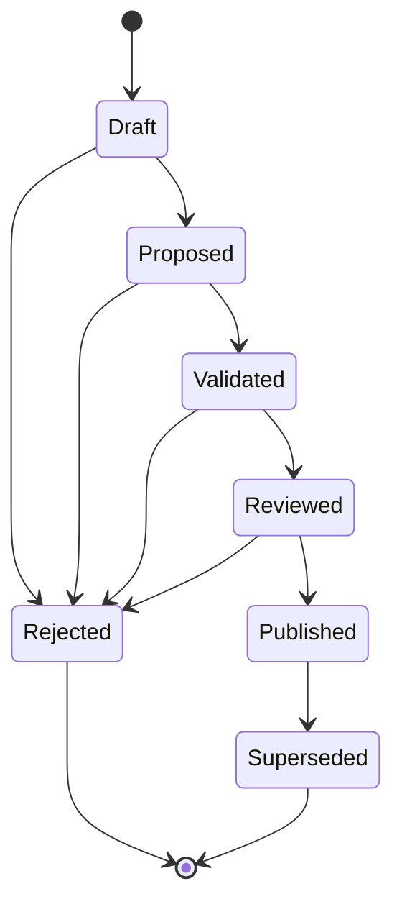
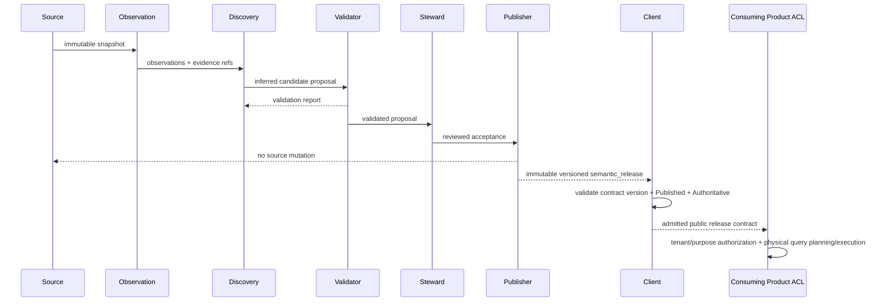
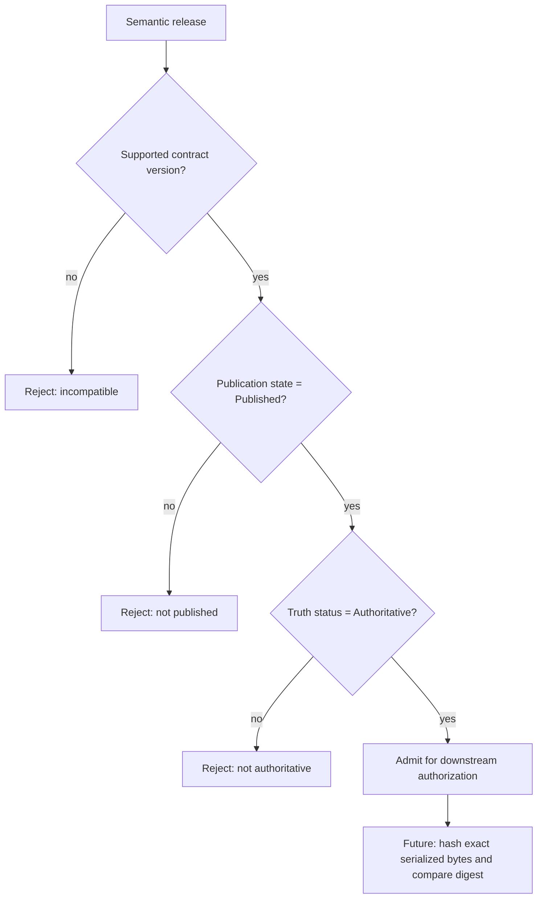

# UML and lifecycle views

## Candidate state machine

## Generation -> publication -> client sequence

## Client admission decision

Client admission is not publication authority and is not downstream authorization. `ReleaseDigest` currently validates the declared digest identity syntax; the future hash step is required before cryptographic integrity is claimed.
