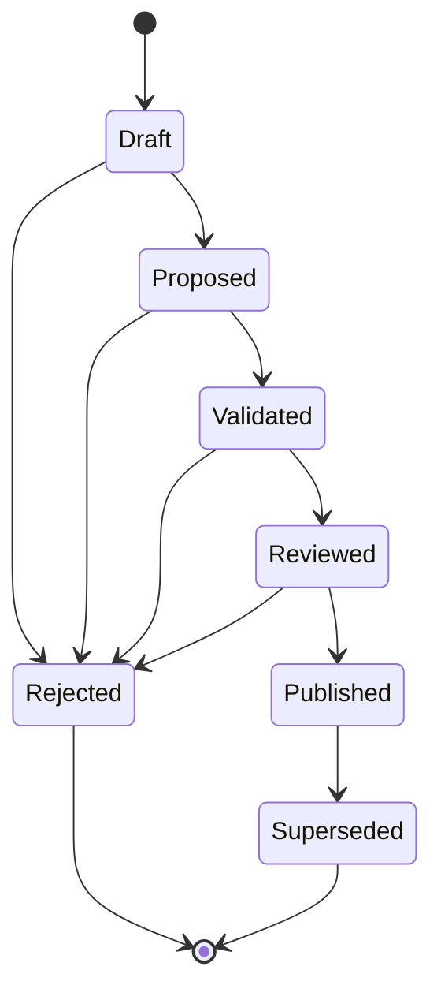
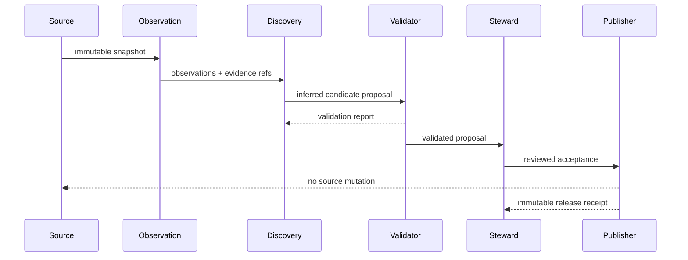

# UML and lifecycle views

## Candidate state machine



## Foundation sequence



## Research intake sequence

```mermaid
sequenceDiagram
    participant Zotero as Zotero Local API
    participant Intake as Research intake
    participant Report as Local proposal report
    participant Steward

    loop bounded pages
        Intake->>Zotero: read items at one library version
        Zotero-->>Intake: items + observed library version
        Intake->>Intake: validate page consistency and every item revision; fail entire read on mismatch
    end
    Intake->>Intake: classify or abstain; link children; find duplicate candidates
    Intake->>Intake: retain excluded metadata; traverse parent links from bibliographic roots
    Intake->>Report: write proposals, complete inventory and unresolved source keys
    Note over Report,Steward: Pending sources prevent a whole-library completion claim; inventory is not approval
    Report->>Steward: review dispositions and merge candidates
    Steward->>Intake: reviewed labels and independently issued receipt
    Intake->>Intake: validate complete partitions and recompute pending ancestry
    Intake->>Intake: verify v2 proposal and retained-source binding
    Note over Intake,Steward: Only locally valid reports reach independent governance verification
    Steward->>Intake: verified canonical-item decisions
    Intake->>Report: before/after/rollback identity manifest
    Report-->>Steward: reversible local mapping; source records preserved
    Steward->>Intake: reviewed collection/tag changes and receipt
    Intake->>Intake: existing item/metadata gates; shared inventory/audit validation; v2 binding
    Intake->>Steward: independently verify complete reviewed set
    Steward-->>Intake: authority result, not a replacement digest
    Intake->>Report: dry-run write plan with exact rollback state
    Intake-->>Zotero: Zotero 9 execute rejected
    opt caller supplies authenticated Zotero 10+ adapter
        Intake->>Zotero: preflight every planned item
        Zotero-->>Intake: exact server/library/item state
        loop stop on first failure
            Intake->>Zotero: conditional complete metadata replacement
            Zotero-->>Intake: post-write revision and complete state
        end
        Intake->>Report: applied/failed/untouched receipt + reverse rollback operations
    end
```
