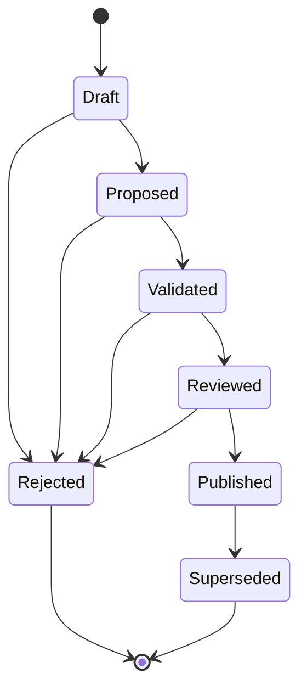
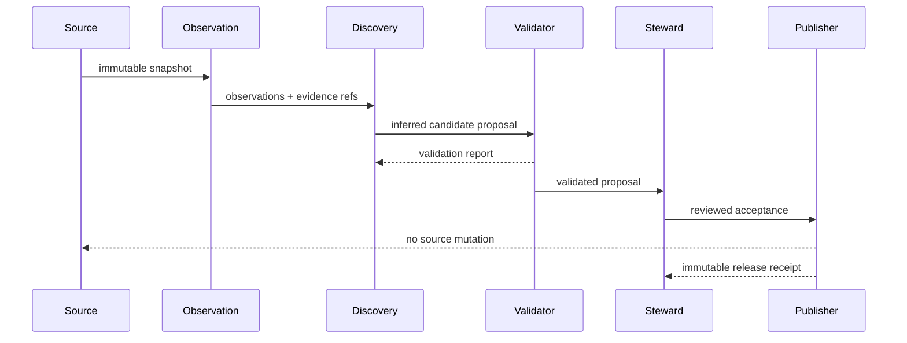

# UML and lifecycle views

## Candidate state machine



## Foundation sequence



## Research intake sequence

```mermaid
sequenceDiagram
    participant Zotero as Zotero Local API
    participant Intake as Research intake
    participant Report as Local proposal report
    participant Steward

    loop bounded pages
        Intake->>Zotero: read items at one library version
        Zotero-->>Intake: items + immutable version headers
    end
    Intake->>Intake: classify or abstain; link children; find duplicate candidates
    Intake->>Report: write proposals and evidence
    Intake->>Report: derive snapshot-bound decision worksheet without bibliographic text
    Report->>Steward: review dispositions and merge candidates
    Steward->>Intake: verified labels for every bibliographic item
    Intake-->>Steward: aggregate completion evidence or incomplete-review failure
    Steward->>Intake: verified canonical-item decisions
    Intake->>Report: before/after/rollback identity manifest
    Report-->>Steward: reversible local mapping; source records preserved
    Steward->>Intake: verified collection/tag changes
    Intake->>Report: dry-run write plan with exact rollback state
    Intake-->>Zotero: Zotero 9 execute rejected
    opt caller supplies authenticated Zotero 10+ adapter
        Intake->>Zotero: preflight every planned item
        Zotero-->>Intake: exact server/library/item state
        loop stop on first failure
            Intake->>Zotero: conditional complete metadata replacement
            Zotero-->>Intake: post-write revision and complete state
        end
        Intake->>Report: applied/failed/untouched receipt + reverse rollback operations
    end
```
