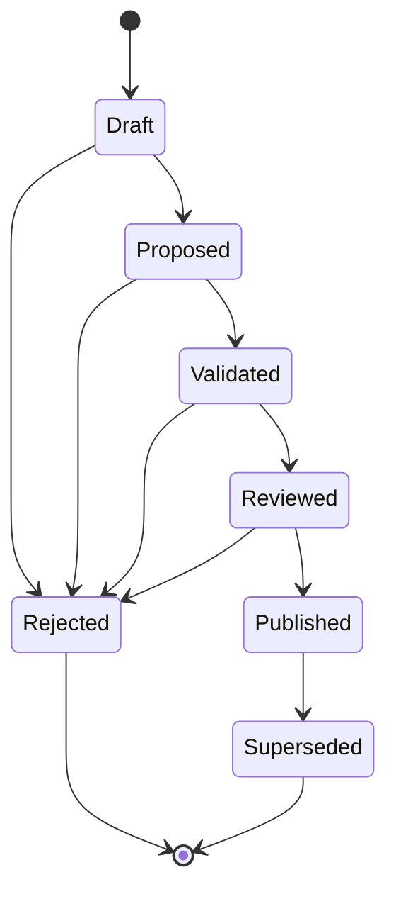
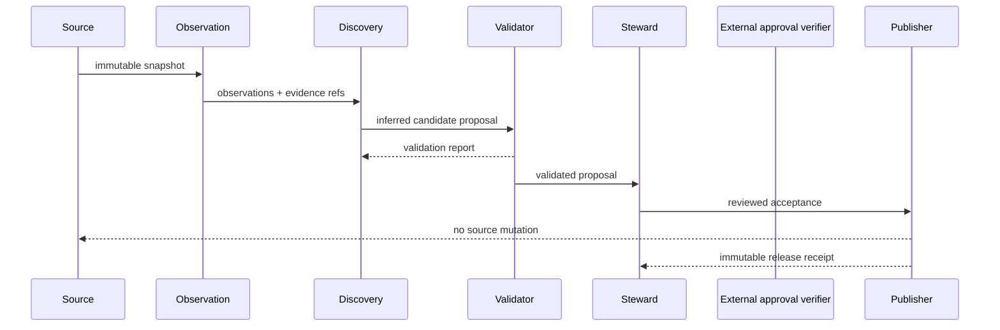

# UML and lifecycle views

## Candidate state machine



## Foundation sequence



## Research intake sequence

```mermaid
sequenceDiagram
    participant Zotero as Zotero Local API
    participant Intake as Research intake
    participant Report as Local proposal report
    participant Capture as Private text capture
    participant Steward

    loop bounded pages
        Intake->>Zotero: read items at one library version
        Zotero-->>Intake: items + observed version headers
    end
    Intake->>Intake: classify or abstain; link children; find duplicate candidates
    Intake->>Report: write proposals and evidence
    opt separate full-text capture requested
        Report->>Intake: unchanged private report binding
        Intake->>Zotero: library and complete manifest bookend
        loop every manifest attachment within budgets
            Intake->>Zotero: read current attachment metadata and full text
            Zotero-->>Intake: metadata + content or explicit missing response
            Intake->>Intake: check identity, parent and independent versions
        end
        Intake->>Zotero: repeat manifest and library bookend
        Intake->>Capture: create new content-bound owner-only artifact
        Note over Report,Capture: non-atomic observation; no changed proposal or approval
    end
    Intake->>Report: derive snapshot-bound decision worksheet without bibliographic text
    opt inspect retained text for pending rows
        Report->>Intake: original report and current worksheet
        Capture->>Intake: separately bounded private capture
        Intake->>Intake: verify capture binding and select canonical pending rows
        Intake-->>Steward: create-new bounded evidence view with missing text visible
        Note over Intake,Steward: read-only view; legacy apply commands reject it
    end
    opt separate capture-bound review campaign
        Note over Intake,Steward: offline CLI through finalization; external verification is a separate library boundary
        Report->>Intake: original report, without importing metadata decisions
        Capture->>Intake: exact retained capture
        Intake->>Intake: create blank capture-bound worksheet
        loop next pending evidence view
            Intake-->>Steward: exact text and pending decisions
            Steward->>Intake: completed decision slots only
            Intake->>Intake: reject duplicate keys, stale selection and changed evidence
            Intake->>Report: new capture-bound worksheet; prior work preserved
        end
        Steward->>Intake: complete worksheet and independently issued approval input
        Intake->>Intake: reverify capture/report and finalize complete labels
        Intake->>Governance: entire capture-bound reviewed set after local validation
        Governance-->>Intake: authenticated receipt decision or rejection
        Intake-->>Steward: capture-bound aggregate result or failure
        Note over Intake,Governance: no transfer to the independent Zotero write authority
    end
    Report->>Steward: review dispositions and merge candidates
    Steward->>Intake: save partially completed worksheet
    Intake->>Report: validate original binding; emit aggregate progress only
    Steward->>Intake: completed worksheet + approval receipt
    Intake->>Report: offline finalization against the original saved report
    Report-->>Steward: reviewed golden set or fail-closed validation error
    Intake-->>Steward: aggregate completion evidence or incomplete-review failure
    Steward->>Intake: verified canonical-item decisions
    Intake->>Report: before/after/rollback identity manifest
    Report-->>Steward: reversible local mapping; source records preserved
    Steward->>Intake: verified collection/tag changes
    Intake->>Report: dry-run write plan with exact rollback state
    Intake-->>Zotero: Zotero 9 execute rejected
    opt caller supplies authenticated Zotero 10+ adapter
        Intake->>Zotero: preflight every planned item
        Zotero-->>Intake: exact server/library/item state
        loop stop on first failure
            Intake->>Zotero: conditional complete metadata replacement
            Zotero-->>Intake: post-write revision and complete state
        end
        Intake->>Report: applied/failed/untouched receipt + reverse rollback operations
    end
```
