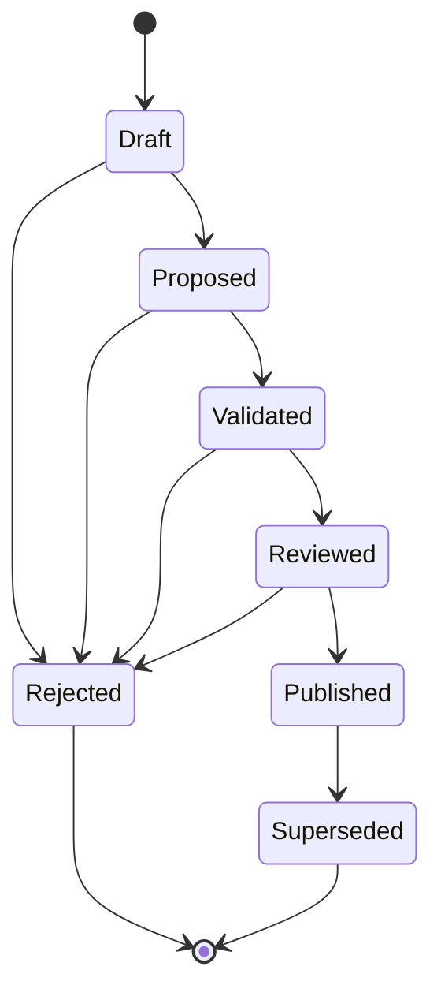
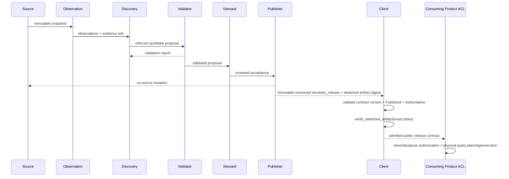
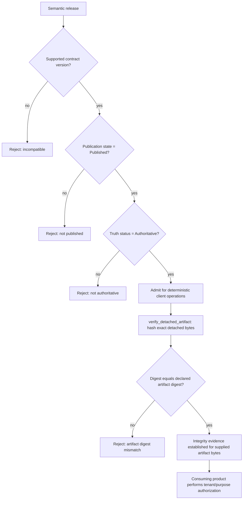

# UML and lifecycle views

## Candidate state machine



## Source Observation authorization and execution

```mermaid
sequenceDiagram
    participant Caller
    participant Request as ObservationRequest
    participant Policy as SourceConnectionRegistry
    participant Adapter as SourceObservationPort
    participant Source
    participant Snapshot as PostgresSchemaSnapshot

    Caller->>Request: key + exact schemas + requested resource envelope
    Request->>Policy: resolve source key
    Policy-->>Request: immutable key + policy binding
    Request->>Policy: authorize exact schema scope against binding
    Policy-->>Request: allow / deny
    Request->>Policy: admit complete ObservationResourceEnvelope against same binding
    Policy-->>Request: allow / deny
    Note over Request,Policy: one non-resetting monotonic operation budget
    Request-->>Caller: AuthorizedObservationRequest or typed failure
    Caller->>Adapter: authorized envelope + cancellation
    Adapter->>Adapter: verify exact binding; read remaining budget
    Adapter->>Source: least-privilege read-only metadata access
    Source-->>Adapter: complete bounded catalog evidence
    Adapter->>Snapshot: authorized envelope + complete observations
    Snapshot-->>Adapter: immutable snapshot or fail closed
```

A source key, schema list, or positive resource limit is never authority on its own. Schema and complete resource-envelope policy default to deny, and both decisions are bound to the same immutable source-policy revision. A wider-than-policy resource request fails before adapter/source/snapshot side effects. The adapter may resolve credentials only from the exact authorized key-and-binding pair and cannot restart the original operation timeout.

## Generation -> publication -> client sequence



## Client admission and integrity decision



Client admission is not publication authority and is not downstream authorization. `ReleaseDigest` validates canonical digest identity syntax; `SemanticReleaseClient::verify_detached_artifact` separately proves whether the exact detached artifact bytes supplied by the caller match that declared identity.