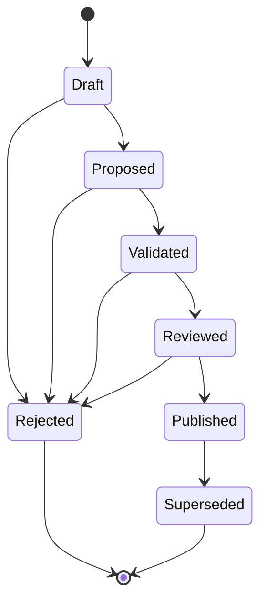
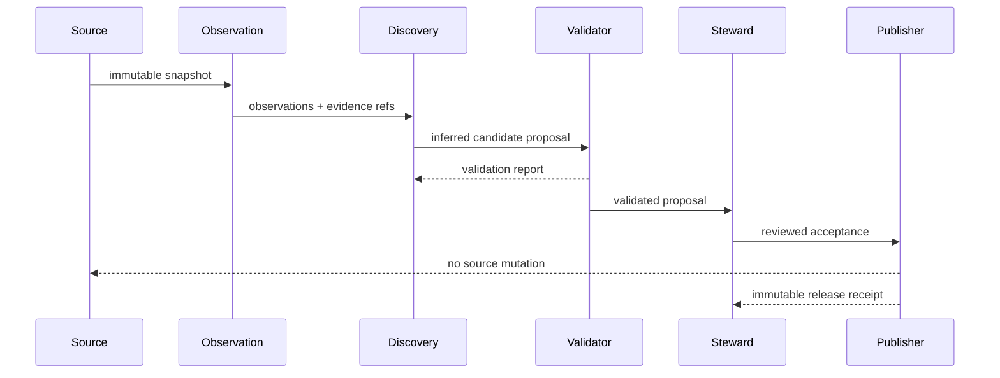

# UML and lifecycle views

## Candidate state machine

```mermaid
stateDiagram-v2
    [*] --> Draft
    Draft --> Proposed
    Draft --> Rejected
    Proposed --> Validated
    Proposed --> Rejected
    Validated --> Reviewed
    Validated --> Rejected
    Reviewed --> Published
    Reviewed --> Rejected
    Published --> Superseded
    Rejected --> [*]
    Superseded --> [*]
```

## Foundation sequence

```mermaid
sequenceDiagram
    participant Source
    participant Observation
    participant Discovery
    participant Validator
    participant Steward
    participant Publisher

    Source->>Observation: immutable snapshot
    Observation->>Discovery: observations + evidence refs
    Discovery->>Validator: inferred candidate proposal
    Validator-->>Discovery: validation report
    Validator->>Steward: validated proposal
    Steward->>Publisher: reviewed acceptance
    Publisher-->>Source: no source mutation
    Publisher-->>Steward: immutable release receipt
```
