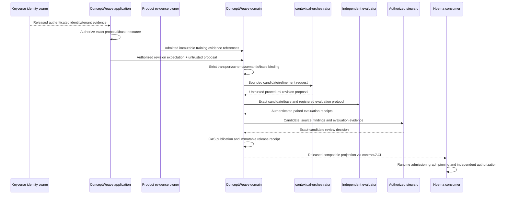

# ADR-PG-20260910: Govern procedural models in ConceptWeave; execute projections in Noema

Status: Proposed. Date: 2026-09-10. Updated: 2026-09-11. Tracking: ConceptWeave #42;
ContextualWisdomLab/.github #2067. This namespaced decision identity avoids reusing
numeric ADR identities already occupied by concurrent Foundation/research work.

## Problem and evidence

The first CWL procedural-graph port put immutable graph/session values, bounded
neighborhood retrieval and preliminary candidate screening in Noema #585/#586.
Those runtime capabilities are useful and remain there. The adoption plan omitted
ConceptWeave's existing responsibility for evidence-bound semantic-model engineering,
leaving procedure authoring, concept alignment and governed publication without the
appropriate canonical owner.

Lu et al. (2026) describe procedure/relation/procedure representation, localized
situational guidance that influences rather than dictates action, and offline edits
to topology and attributes using successful and failed trajectories. Edits are
screened against held-out performance; rejected edits are retained. The Korean
article motivated this request. These method statements do not prescribe CWL's
repository ownership, IAM, governance, locale or release design. This ADR introduces
those CWL choices and does not claim reproduction of the paper's benchmark results.

Foundation #1 defines Source Observation, Semantic Discovery, Model Validation,
Governance & Publication and Interoperability. Protected `main` is still the
repository initializer; the procedural implementation discussed below is an
unreleased Draft-branch source slice, not protected or published authority.

## Alternatives and decision

1. Keep authoring/refinement/publication entirely in Noema. Reject: that would make
   its execution runtime compete with ConceptWeave's semantic engineering and review
   lifecycle.
2. Move the entire runtime into ConceptWeave. Reject: that would duplicate Noema
   execution, cancellation, checkpoint and tool boundaries.
3. Extend ConceptWeave's engineering contexts to procedural models and publish a
   released projection for Noema. Select. Domain facts and procedure approval remain
   with each product/domain owner; only released contracts cross owner boundaries.

| Responsibility | Canonical owner |
| --- | --- |
| Evidence intake, procedure candidate generation and alignment | ConceptWeave Source Observation / Semantic Discovery |
| Structural and semantic model validation | ConceptWeave Model Validation, Rust |
| Model revision, rejection history, steward review and publication | ConceptWeave Governance & Publication |
| Shared graph, evaluation and release interchange | context-graph-contracts; no wire-contract fork |
| Online projection, graph pinning, localization, guidance and lifecycle | Noema |
| Guide/refiner/solver model calls and provider routing | contextual-orchestrator |
| Task stimuli, item/rubric protocol and independent acceptance evidence | Evaluation owner / psychometrics-commons |
| Published-artifact catalog, discovery and consumer access experience | semantic-data-portal |
| Context map, architecture decisions and product adoption matrix | enterprise-architecture-core |
| Identity, credential and authentication trust evidence | Keyverse |
| Business facts, purpose/IAM, policy and side-effect permission | Each product and its existing policy/security owners |

Noema's preliminary arithmetic screening can remain a diagnostic implementation;
it is not the canonical store, evaluator authority or publisher. No forced source
migration, deletion, duplication or direct dependency on its mutable PR is added.

## Ubiquitous language and semantic distinction

A **procedure concept** identifies a described step, not an execution instance.
A **procedural model draft** is inferred candidate knowledge. A **revision proposal**
compares a retained base with a complete proposed model and training-evidence references.
A **validation receipt** reports checks under a named protocol; it is not an approval.
A **procedural model release** is an approved immutable representation. An **execution
projection** is a compatible consumer view pinned for a run; it cannot authorize tools.

Keep three meanings distinct. Factual ontologies describe entities and relations;
procedural models describe possible steps and situational guidance; policy contracts
determine what a caller is permitted to do. An edge named `requires` is not automatically
an OWL restriction, an executable precondition, a transitive dependency rule or a grant.
`leads_to`, `requires` and `enables` are the initial advisory vocabulary only. A later
profile must specify any executable interpretation explicitly, outside this profile.

Procedure-to-concept alignment retains qualified released object references. Similar
labels or embeddings do not justify merging identities. Product vocabulary and facts
stay with their domain owner; only references, not foreign payloads, enter this model.
Observed frequent behavior is not automatically a correct or normative procedure.

## Product requirements and customer scenario

PG-FR-1: A domain steward can inspect the SOP/API/manual or admitted observable
training evidence supporting each proposed procedure and relationship.

PG-FR-2: Authoring preserves stable IDs, procedure categories, directed advisory
relations, localized condition/guidance/pitfalls and exact semantic/tool references.
Unresolved alignment remains visible rather than guessed or silently normalized.

PG-FR-3: Offline revision comparison preserves the retained base and failed proposals.
The refiner receives approved training evidence, not validation answers or final-test
content. Independent evaluation compares the same task cases/model/tool/rubric context.

PG-FR-4: Steward review and immutable publication bind exact candidate/artifact,
source evidence, validation and reviewer decisions. Publication is not execution
activation. Supersession, revocation and rollback preserve history.

PG-FR-5: A Noema consumer admits only compatible released projections with explicit
unsupported/oversized/incomplete results. Existing executions retain their revision
and separately honor current cancellation, policy and revocation decisions.

PG-FR-6: The authoring/review UI exposes source spans, graph differences, findings,
evaluation and reviewer receipts, and release history. DiagramWeave/inkspan and
product-owned reusable components should be integrated rather than cloned.

Example: the central review profile describes reading a finding, reproducing it on
exact source, repairing it and verifying checks. ConceptWeave may propose a better
sequence after repeated failed reproductions. It cannot declare those findings true,
mark GitHub checks successful, approve a PR or merge it. A billing-domain procedure
likewise cannot change a rate or charge a customer merely because its model is published.

## Contract and source implementation checkpoint

`contracts/procedural-model-draft.schema.json` and
`contracts/procedural-revision-proposal.schema.json` use local `0.1.0-draft.1`
identities. They do not change the existing generic candidate/0.1.0 schema, Noema's
graph schema or an already released shared contract. Evidence references retain local
digest/bound requirements and remain unverified references until later admission gates.

The model envelope permits inferred/draft only. It contains tenant/task/domain-owner
references, an entry procedure ID, 1–256 procedure records, 0–512 relationship records,
and bounded evidence arrays. Procedure categories are `tool_operation`,
`reasoning_step`, `skill_procedure` and `task_state`. Tool-operation candidates require
an artifact-bound tool-contract reference, still non-authorizing at this layer.

Locale maps admit `ko`, `en`, `ja`, `zh`, `vi`, `es`, `de`, `fr`, reject unsupported
keys, and require at least one nonblank bounded value. Partial authoring labels are
allowed; no eight-locale publication completeness is claimed. Ontology labels remain
separate from the database-backed UI translation ledger. Unicode normalization,
fallback and completeness rules require an explicit release/profile contract.

Revision proposals carry an exact base artifact reference, complete candidate,
declared training evidence, retained rejection references and rationale. The envelope
cannot carry self-issued approval fields, holdout scores or raw trajectory fields.
Free-form text can still contain malicious or sensitive content; structural admission
is not scrubbing, source authentication, prompt-injection detection or proof of an
actual training partition.

Repository-owned schema validation runs in-process with lockfile-pinned `ajv` 8.20.0
Draft 2020-12. Dynamic `npx`, `ajv-cli`, coercion/default insertion and registry-resolved
package execution are not part of the current path.

Exact #44 source now contains private, unpublished Rust seams for:

- raw borrowed-byte admission with the 2 MiB ceiling applied before UTF-8 validation;
- strict JSON grammar, bounded depth, surrogate handling and decoded duplicate-member rejection;
- canonical Draft 2020-12 transport-to-domain mapping with unknown/missing/type/conditional-field rejection;
- schema-significant semantic projection, evidence closure, node/edge identity, reachability and tool-operation invariants;
- canonical revision-envelope mapping that retains `proposal_state: proposed`, `decision_authority: none`, exact `base_model_ref`, candidate scope, bounded training evidence/rejection references/rationale, and compares proposal/base/candidate coordinates with a separately supplied `ProceduralRevisionExpectation` before deterministic candidate validation.

These source repairs supersede the earlier plan that described duplicate-key, byte,
entry/edge/evidence membership, semantic projection and base/scope comparison as wholly
unimplemented Rust work. Historical shape-positive witnesses remain useful regression
provenance; they are no longer current claims that no Rust check exists.

The Rust seams are intentionally private because native acceptance is still absent on
the current Draft head. Source-level RED/repair/test ancestry is not equivalent to
pinned Rust 1.98 fmt, strict Clippy, native tests, rustdoc, release, owned-production
coverage or hosted Product/security/review evidence. No execution, publication or
consumer release may rely on this mutable branch.

## Authentication and application authorization boundary

`ProceduralRevisionExpectation` is deliberately an expectation, not an authentication
receipt. Equality against separately supplied coordinates proves only equality. It
must not be constructed from the untrusted revision payload and must not be relabeled
`authenticated` inside the domain.

A production application adapter must first consume an **immutable released Keyverse
trust contract** that establishes the relying-party identity/subject and tenant context
under Keyverse-owned issuer/signature/algorithm/audience/time/replay/rotation semantics.
ConceptWeave then applies its own authorization for the requested proposal and exact
base resource before constructing the private expectation. Keyverse must not carry
ConceptWeave proposal IDs, semantic-release truth or application authorization policy;
ConceptWeave must not copy mutable Keyverse source or implement JWT/provider trust logic
inside `conceptweave-domain`.

As of this checkpoint, protected Keyverse `main@7d9151cd2da260e118020c938c7358e2ee75d541`
has no published GitHub release. Keyverse issue #155 tracks a versioned subject-assertion
trust contract and conformance fixtures. Until an immutable owner artifact exists, the
ConceptWeave application adapter remains intentionally unimplemented rather than
manufacturing a local `authenticated=true` receipt.

Authentication remains distinct from resource authorization. After Keyverse identity
admission, ConceptWeave must bind the authenticated tenant/request context to the exact
proposal/base resource and reject stale, replayed or mismatched context before a
governed state transition.

## Persistence and publication boundary

Compute canonical material-content digests using a released CGC profile and conformance
fixtures rather than a second incompatible copy of Noema hashing. Annotation, locale,
evidence or topology changes must affect the appropriate identity; input-order changes
must not. Candidate, structural, evidence, evaluation, approval and release IDs remain
separate.

Planned state belongs to existing ConceptWeave contexts: `procedural_model_revision`,
`procedure_definition`, `procedure_relation`, `procedure_evidence_binding`,
`procedural_revision_proposal`, `procedural_rejection_record` and publication receipts
are 3NF entities when persistence is introduced. Scope every key/FK by tenant/model.
Use immutable revision insertion, item-level UPSERT only where allowed, compare-and-swap
against the retained head, transactional outbox and idempotency receipts. Concurrent
publishers must not lose a revision or overwrite an accepted release.

A release must bind provenance, source/profile versions, validity period, explicit
status, locale labels and evaluation/confidence status. Do not invent a numeric
confidence. It must be absent/unassessed or accompanied by an owner-defined calibrated
measurement and evidence. Authentication, stewardship and deployment activation remain
separate. No raw credential, hidden reasoning or unnecessary PII enters shared artifacts.

The sequence is intended architecture, not observed deployment. Rejected proposals
retain evaluation-context-scoped history without exposing holdout answer keys to the
refiner. Fresh final confirmation is required after repeated validation search; mean
non-regression is not statistical significance, validity or standard setting.

## Rollout and acceptance

Foundation/Product bootstrap and central CodeQL settlement remain prerequisites. After
those protected prerequisites integrate, restack this stack ordinarily/non-force and
obtain fresh exact-head native Rust 1.98 and hosted evidence before widening the private
Rust seam. Then consume a released Keyverse trust artifact through a versioned
application port, implement ConceptWeave proposal/base authorization, and only afterward
advance released semantic/tool artifact authenticity/ACL/capability, independent
evaluation, steward decision binding, immutable/CAS publication, released CGC
interoperability, Noema projection and shadow invocation.

No cross-repository runtime consumes this mutable branch. Shadow `.github` review and
Naruon read-only tasks first. Compare no graph, fixed graph and evolved graph under
matched task/model/tool conditions, retaining failure counts and denominators,
correctness dimensions, tokens/cost and latency separately. Each other product must
identify an applicable agent task or a documented exclusion; deterministic numerical
kernels are not wrapped merely to claim adoption.

Before canary, prove stale-evidence/tenant mismatch rejection, unsafe guidance cannot
widen tools, cancellation and live revocation, duplicate side-effect prevention,
publication conflicts and rollback after partial failures. Retain policy, quarantine,
egress and credential controls from their canonical owners. Existing timeouts or
provider termination rules are not replaced with a new blanket model time limit.

No UI is built by this slice. Future UI needs Figma/token IDs, Storybook normal/loading/
empty/error/permission/responsive/interaction states, keyboard/screenshot/E2E and all
supported locale layout checks before any UI delivery or accessibility claim.

## Verification record and remaining uncertainty

The checked-in structural corpus and earlier Node/Python runs remain historical evidence
at their original heads. The current validation path uses lockfile-pinned AJV 8.20.0,
and #44 retains thirteen source-repair lineages through revision-envelope/base/context
binding. Those histories establish what was repaired in source, not exact-current
execution acceptance.

The current execution environment used for this line of work has not established a
pinned Rust 1.98 native run for the current #44 head, and protected ConceptWeave `main`
still lacks the normally integrated Product bootstrap. Therefore workspace/fmt/strict
Clippy/rustdoc/release, owned coverage, hosted security and qualifying independent review
remain required on one unchanged post-prerequisite head. No source-shaped seam is a
semantic release, policy grant or runtime activation.

## References and traceability

Lu, Y., Chen, Y., Wu, S., & Arık, S. Ö. (2026). *Procedural graphs: Self-evolving execution
structures for LLM agents* (arXiv:2609.09153v1). arXiv.
https://arxiv.org/abs/2609.09153

코난쌤. (2026, September 10). *Procedural Graph: LLM 에이전트를 위한 자가진화 절차 그래프
(arXiv 2609.09153) 논문 정리*.
https://conanssam.com/posts/2026-09-10-procedural-graphs-self-evolving-llm-agents
