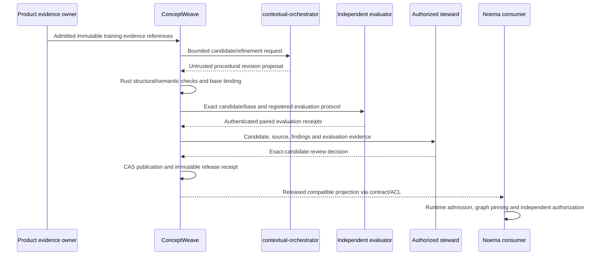

# ADR-PG-20260910: Govern procedural models in ConceptWeave; execute projections in Noema

Status: Proposed. Date: 2026-09-10. Tracking: ConceptWeave #42;
ContextualWisdomLab/.github #2067. This namespaced decision identity avoids reusing
numeric ADR identities already occupied by concurrent Foundation/research work.

## Problem and evidence

The first CWL procedural-graph port put immutable graph/session values, bounded
neighborhood retrieval and preliminary candidate screening in Noema #585/#586.
Those runtime capabilities are useful and remain there. The adoption plan omitted
ConceptWeave's existing responsibility for evidence-bound semantic-model engineering,
leaving procedure authoring, concept alignment and governed publication without the
appropriate canonical owner. The user explicitly requested that correction.

Lu et al. (2026) describe procedure/relation/procedure representation, localized
situational guidance that influences rather than dictates action, and offline edits
to topology and attributes using successful and failed trajectories. Edits are
screened against held-out performance; rejected edits are retained. The Korean
article motivated this request. These method statements do not prescribe CWL's
repository ownership, IAM, governance, locale or release design. This ADR introduces
those CWL choices and does not claim reproduction of the paper's benchmark results.

Observed Foundation #1 at `60f14a6e85a83d56c2eea43b34d52b3366bb1735`
defines Source Observation, Semantic Discovery, Model Validation, Governance &
Publication and Interoperability. Its generic candidate schema does not represent
procedural nodes, localized edge annotations or revision proposals. Main observed
at `f4f440dd58c77d7cd90dff8a1eb2eeb9a9940425` contains README only.
These are dated source observations, not evergreen authority or released dependencies.

## Alternatives and decision

1. Keep authoring/refinement/publication entirely in Noema. This would make its
   execution runtime compete with ConceptWeave's semantic engineering and review
   lifecycle. Reject the ownership overlap, not the existing Noema source.
2. Move the entire runtime into ConceptWeave. This would duplicate Noema execution,
   cancellation, checkpoint and tool boundaries. Reject.
3. Extend ConceptWeave's engineering contexts to procedural models and publish a
   released projection for Noema. Select. Keep the domain facts and procedure
   approval responsibility with each product/domain owner, and share only released
   contracts. There is no new central runtime or product repository.

| Responsibility | Canonical owner |
| --- | --- |
| Evidence intake, procedure candidate generation and alignment | ConceptWeave Source Observation / Semantic Discovery |
| Structural and semantic model validation | ConceptWeave Model Validation, Rust |
| Model revision, rejection history, steward review and publication | ConceptWeave Governance & Publication |
| Shared graph, evaluation and release interchange | context-graph-contracts; no wire-contract fork |
| Online projection, graph pinning, localization, guidance and lifecycle | Noema |
| Guide/refiner/solver model calls and provider routing | contextual-orchestrator |
| Task stimuli, item/rubric protocol and independent acceptance evidence | Evaluation owner / psychometrics-commons |
| Published-artifact catalog, discovery and consumer access experience | semantic-data-portal |
| Context map, architecture decisions and product adoption matrix | enterprise-architecture-core |
| Credential authority | keyverse |
| Business facts, purpose/IAM, policy and side-effect permission | Each product and its existing policy/security owners |

Noema's preliminary arithmetic screening can remain a diagnostic implementation;
it is not the canonical store, evaluator authority or publisher. No forced source
migration, deletion, duplication or direct dependency on its mutable PR is added.

## Ubiquitous language and semantic distinction

A **procedure concept** identifies a described step, not an execution instance.
A **procedural model draft** is inferred candidate knowledge. A **revision proposal**
compares a retained base with a complete proposed model and training-evidence references.
A **validation receipt** reports checks under a named protocol; it is not an approval.
A **procedural model release** is an approved immutable representation. An **execution
projection** is a compatible consumer view pinned for a run; it cannot authorize tools.

Keep three meanings distinct. Factual ontologies describe entities and relations;
procedural models describe possible steps and situational guidance; policy contracts
determine what a caller is permitted to do. An edge named `requires` is not automatically
an OWL restriction, an executable precondition, a transitive dependency rule or a grant.
`leads_to`, `requires` and `enables` are the initial advisory vocabulary only. A later
profile must specify any executable interpretation explicitly, outside this profile.

Procedure-to-concept alignment retains qualified released object references. Similar
labels or embeddings do not justify merging identities. Product vocabulary and facts
stay with their domain owner; only references, not foreign payloads, enter this model.
Observed frequent behavior is not automatically a correct or normative procedure.

## Product requirements and customer scenario

PG-FR-1: A domain steward can inspect the SOP/API/manual or admitted observable
training evidence supporting each proposed procedure and relationship.

PG-FR-2: Authoring preserves stable IDs, procedure categories, directed advisory
relations, localized condition/guidance/pitfalls and exact semantic/tool references.
Unresolved alignment remains visible rather than guessed or silently normalized.

PG-FR-3: Offline revision comparison preserves the retained base and failed proposals.
The refiner receives approved training evidence, not validation answers or final-test
content. Independent evaluation compares the same task cases/model/tool/rubric context.

PG-FR-4: Steward review and immutable publication bind exact candidate/artifact,
source evidence, validation and reviewer decisions. Publication is not execution
activation. Supersession, revocation and rollback preserve history.

PG-FR-5: A Noema consumer admits only compatible released projections with explicit
unsupported/oversized/incomplete results. Existing executions retain their revision
and separately honor current cancellation, policy and revocation decisions.

PG-FR-6: The authoring/review UI exposes source spans, graph differences, findings,
evaluation and reviewer receipts, and release history. DiagramWeave/inkspan and
product-owned reusable components should be integrated rather than cloned.

Example: the central review profile describes reading a finding, reproducing it on
exact source, repairing it and verifying checks. ConceptWeave may propose a better
sequence after repeated failed reproductions. It cannot declare those findings true,
mark GitHub checks successful, approve a PR or merge it. A billing-domain procedure
likewise cannot change a rate or charge a customer merely because its model is published.

## Implemented input-contract slice

`contracts/procedural-model-draft.schema.json` has a new local draft identity;
`contracts/procedural-revision-proposal.schema.json` references it. Both use
`0.1.0-draft.1`. They do not change the existing generic candidate/0.1.0 schema,
Noema's graph schema or an already released shared contract. The evidence item
reuses the existing generic schema by `$ref`, with additional local digest/bound limits.

The model envelope permits inferred/draft only. It contains tenant/task/domain-owner
references, an entry procedure ID, 1–256 procedure records, 0–512 relationship records,
and bounded evidence arrays. This profile's categories are `tool_operation`,
`reasoning_step`, `skill_procedure` and `task_state`; they are CWL profile choices.
Tool-operation candidates require an artifact-bound tool-contract reference, which
is still only an unverified reference at this layer.

Locale maps admit `ko`, `en`, `ja`, `zh`, `vi`, `es`, `de`, `fr`, reject unsupported
keys, and require at least one nonblank bounded value. Partial authoring labels are
allowed; no eight-locale publication completeness is claimed. Ontology labels remain
separate from the database-backed UI translation ledger. Unicode normalization,
fallback and completeness rules require a later explicit release/profile contract.

Revision proposals carry base artifact reference, complete candidate, declared training
evidence, retained rejection references and rationale. The envelope cannot carry
self-issued approval fields, holdout scores or raw trajectory fields. Free-form text
can still contain malicious or sensitive content; shape rejection is not scrubbing,
authentication, prompt-injection detection or proof of an actual training partition.

The corpus has 46 cases: nine ordinary positive shapes, 33 invalid shapes, and four
shape-positive semantic-gap witnesses. In particular, a missing entry, a dangling
endpoint, and a duplicate identity with different record content need Rust checks;
`uniqueItems` only detects identical JSON records. The fourth witness requires
external evidence authenticity and exact base/scope comparison. They are deliberately
NOT described as valid graphs or approved revisions.

`scripts/check_procedural_contracts.mjs` materializes the fixed unit corpus in a
private temporary directory, compiles the schemas and checks positive/negative groups
using the already used AJV CLI 5.0.0. It has no product API or model/provider role.
No coercion, default insertion or removal of unknown fields is enabled. Product adds
this fixture check and Node runner tests without changing workflow triggers, permissions,
concurrency, Rust/coverage/security gates or the pinned dependencies.

## Planned Rust and persistence boundary, not implemented here

Construct a private immutable Rust procedural-model aggregate only after bounded
strict transport parsing and rejection of duplicate JSON keys. Validate node/edge/entry
membership, duplicate logical IDs/triples, evidence closure, exact tenant/task/base
binding, released semantic/tool references and nonempty necessary annotations. Define
cycle/reachability rules per task profile; do not force every procedural model into a DAG.

Compute canonical material-content digests using a released CGC profile and conformance
fixtures, not a second incompatible copy of Noema's local hashing. Annotation, locale,
evidence or topology changes must affect the appropriate identity; input-order changes
must not. Separate candidate, structural, evidence, evaluation, approval and release IDs.

State belongs to existing ConceptWeave contexts: `procedural_model_revision`,
`procedure_definition`, `procedure_relation`, `procedure_evidence_binding`,
`procedural_revision_proposal`, `procedural_rejection_record` and publication receipts
are planned 3NF entities, not implemented tables. Scope every key/FK by tenant/model.
Use immutable revision insertion, item-level UPSERT only where allowed, compare-and-swap
against the retained head, transactional outbox and idempotency receipts. Concurrent
publishers must not lose a revision or overwrite an accepted release.

A release must bind provenance, source/profile versions, validity period, explicit
status, locale labels and evaluation/confidence status. Do not invent a numeric
confidence. It must be absent/unassessed or accompanied by an owner-defined calibrated
measurement and evidence. Authentication, stewardship and deployment activation remain
separate. No raw credential, hidden reasoning or unnecessary PII enters shared artifacts.

The sequence is intended architecture, not observed deployment. Rejected proposals
retain evaluation-context-scoped history without exposing holdout answer keys to the
refiner. Fresh final confirmation is required after repeated validation search;
mean non-regression is not statistical significance, validity or standard setting.

## Rollout and acceptance

Foundation/bootstrap remain prerequisites. First review this contract-only child.
Then implement Rust validation, independently verified evidence and publication,
released CGC interoperability, Noema projection and actual shadow invocation in that
order. No cross-repository runtime consumes this mutable branch.

Shadow .github review and Naruon read-only tasks first. Compare no graph, fixed graph
and evolved graph under matched task/model/tool conditions, retaining failure
counts and denominators, correctness dimensions, tokens/cost and latency separately.
Each other product must identify an applicable agent task or a documented exclusion;
deterministic numerical kernels are not wrapped merely to claim adoption.

Before canary, prove stale-evidence/tenant mismatch rejection, unsafe guidance cannot
widen tools, cancellation and live revocation, duplicate side-effect prevention,
publication conflicts and rollback after partial failures. Retain policy, quarantine,
egress and credential controls from their canonical owners. Existing timeouts or
provider termination rules are not replaced with a new blanket model time limit.

No UI is built by this slice. Future UI needs Figma/token IDs, Storybook normal/loading/
empty/error/permission/responsive/interaction states, keyboard/screenshot/E2E and
all supported locale layout checks before any UI delivery or accessibility claim.

## Verification record and remaining uncertainty

The authoring environment has Node 22.16.0 and Python jsonschema 4.26.0, but lacks
Rust 1.98 and a cached AJV CLI. The same Node-materialized 46 cases passed independent
Draft 2020-12 schema validation. Sixteen Node test-runner assertions passed. An offline
AJV availability attempt failed with ENOTCACHED; native AJV and whole-workspace CI
are not claimed. The initial absent-runner import failure records test-file ordering
only, not an executed behavioral RED. The unchanged generic schema rejecting these
new envelopes is a capability gap, not a defect in that existing contract.

Required remaining evidence: native Product AJV and Node runner checks, all inherited
Rust/coverage/security gates and independent review on the unchanged PR head. Schema
shape is not semantic integrity, release approval, production performance or deployment.

## References and traceability

Lu, Y., Chen, Y., Wu, S., & Arık, S. Ö. (2026). *Procedural graphs: Self-evolving execution
structures for LLM agents* (arXiv:2609.09153v1). arXiv.
https://arxiv.org/abs/2609.09153

코난쌤. (2026, September 10). *Procedural Graph: LLM 에이전트를 위한 자가진화 절차 그래프
(arXiv 2609.09153) 논문 정리*.
https://conanssam.com/posts/2026-09-10-procedural-graphs-self-evolving-llm-agents

AJV CLI maintainers. (n.d.). *ajv-cli: JSON schema version, compile and test commands*.
https://github.com/ajv-validator/ajv-cli/blob/master/README.md

Method -> issue #42 -> PG-FR-1..6 -> these draft schemas ->
`contracts/fixtures/procedural-authoring.cases.json` -> existing Product fixture step.
The detailed source claims and CWL decisions above are intentionally distinguished;
no external benchmark score or paper claim substitutes for CWL evaluation evidence.
